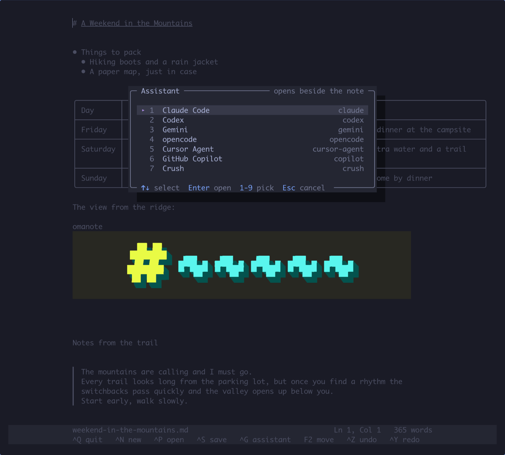

 

# omanote

A small markdown note editor for the terminal. Think *nano for markdown*: open it and type. There are no modes and nothing to configure, and it is a single binary.

Markdown renders as you write. Headings, **bold**, links, checkboxes, tables and images show formatted, and the raw syntax only appears on the line you are editing.



## Install

```sh
curl -fsSL https://raw.githubusercontent.com/iluxav/omanote/main/install.sh | sh
```

This downloads the latest release for your machine (Linux or macOS, x86_64 or ARM), verifies its checksum and puts `omanote` in `~/.local/bin`.

| Option | |
| --- | --- |
| `OMANOTE_VERSION=v0.1.0` | install a specific release |
| `OMANOTE_INSTALL_DIR=/usr/local/bin` | install somewhere else |

Uninstall (your notes are kept):

```sh
curl -fsSL https://raw.githubusercontent.com/iluxav/omanote/main/install.sh | sh -s -- --uninstall
```

### From source

Needs a [Rust toolchain](https://rustup.rs).

```sh
git clone https://github.com/iluxav/omanote && cd omanote
make install      # builds and copies to ~/.local/bin
make uninstall
```

## Use

```sh
omanote                 # a new, empty note
omanote readme          # find a note by name and open it
omanote notes/idea.md   # open that file, or start it if it does not exist
omanote --demo          # a note that shows everything off
```

`omanote <name>` looks in the current folder and in every vault. Case and the `.md` do not matter, so `omanote readme` opens `README.md` and `omanote my ideas` opens `My Ideas.md`. One match opens straight away; with several you get the list (`Tab` to move, `Enter` to open); with none you get a new note, and `Ctrl+S` offers to save it under that name.

Write first, name it later: on a new note `Ctrl+S` asks where to keep it (a vault, or the current folder), with the file name prefilled from your first line (`# Trip plan` → `trip-plan.md`). From then on notes save themselves as you type. A note that has no file yet is never dropped silently: quitting, `Ctrl+N` or opening another note asks where to save it first (or `Ctrl+D` to discard it).

| Key | |
| --- | --- |
| `Ctrl+N` | start a new note |
| `Ctrl+P` | find a note by fuzzy search, or create one |
| `Ctrl+S` / `Ctrl+Q` | save / quit |
| `Ctrl+F`, `F3` | find in the note, find the next one |
| `F2` | move, rename or copy the note: another vault, another folder, another name |
| `@` | link another note: suggestions as you type, or create one |
| `Ctrl+K` | make the selected text a link |
| `Ctrl+O` | open the link under the cursor |
| `Alt+O` | open the link beside this note, on the right |
| `F6` | with two notes open: move to the other one (`Ctrl+Q` closes the one you are in) |
| `Alt+←` / `Alt+→` | back to the note you came from / forward again |
| `Ctrl+G` | an AI agent of your choice in a pane beside the note |
| `Ctrl+Z` / `Ctrl+Y` | undo / redo |
| `Ctrl+C` / `Ctrl+X` / `Ctrl+V` | copy / cut / paste |
| `Shift+arrows`, `Ctrl+A` | select |
| `Ctrl+arrows` | move by word |
| `Ctrl+B` / `Ctrl+I` | bold / italic |
| `Ctrl+T` | toggle a task checkbox |
| `Enter` | continues lists, numbering and quotes |

The mouse works too: click, drag to select, double-click a word, scroll, click a checkbox.

### Finding text

`Ctrl+F` searches the note you are in. The search takes the footer's place, so the text stays in view: every match lights up as you type, the one you are on is selected, and the count (`3 of 12`) sits on the right. `Enter` or `↓` goes to the next match, `↑` or `Shift+Enter` to the one before, round and round; `Esc` closes the search and leaves the match selected, so typing replaces it and `Ctrl+C` copies it. The search starts from where your cursor was, and adding a letter narrows it from there rather than jumping ahead.

Case is ignored until you type a capital: `japan` finds `Japan` and `JAPAN`, `Japan` finds only that. With a few words selected, `Ctrl+F` starts on them. `F3` and `Shift+F3` search again for the last thing you looked for. Text that markdown hides, such as the address inside a link, is found too, and shows itself when the search lands on it. It works the same in plain-text files, and with two notes open it searches the one that has the keyboard.

### Linking notes

Type `@` and start typing a name. A list of matching notes from your vaults opens under the cursor and narrows as you type; its last entry is always **Create “name.md”**, for a note that does not exist yet. `↑` `↓` choose, `Enter` turns the `@name` into a link, `Esc` (or just carrying on with your sentence) closes the list. An `@` in the middle of a word, such as an e-mail address, does nothing.

The link is ordinary markdown with a relative path, `[trip plan](trips/trip%20plan.md)`, so it also works on GitHub and in any other markdown tool. A created note starts with its name as a heading, in the same folder as the note you are writing.

`Ctrl+O` opens the link under the cursor (so do `Ctrl+Enter` and `Ctrl+click`): a note opens in place; a web address, picture or PDF opens with your desktop's default program. `[[wiki links]]` are followed too, by name. If a linked note has been moved since, omanote finds it by name in your vaults; if it does not exist anywhere, following the link starts it.

#### Links to the web, and links on your own words

Copy a web address and paste it:

- with text selected, the text becomes the link: `[the docs](https://…)`;
- with nothing selected, you get a link under a short readable name, `[github.com/iluxav/omanote](https://…)`, so a long address does not sprawl across the note. One `Ctrl+Z` turns it back into the plain address, if that is what you wanted;
- an address of a picture, pasted on an empty line, becomes `` and shows the picture.

`Ctrl+K` makes the selected text a link without anything in the clipboard: you get `[your text]()` with the cursor between the brackets, ready for an address to be typed or pasted, or for `@` to pick one of your notes (there it fills in just the path). With an address already in the clipboard, `Ctrl+K` completes the link in one go. None of this happens in code blocks, in plain-text files, or inside the brackets of a link, where a pasted address stays an address. It makes no difference how you paste: `Ctrl+V`, your terminal's own paste (`Ctrl+Shift+V`, the middle button) and Omarchy's `Super+V` all do the same.

#### Two notes side by side

`Alt+O` on a link (or `Ctrl+Shift+O`, or `Alt+click`) opens the note on the right and leaves the one you are in on the left, so you can read one while writing the other. Both are real editors. `F6` or a click moves the keyboard across; the footer under each note shows which one has it. Links followed in the right-hand note open on the right, so the left one stays put as you wander; from the left, `Ctrl+O` still opens in place and `Alt+O` sends the link to the right. `Ctrl+Q` closes the side you are in, and the other note gets the window back. Each side has its own `Alt+←` history.

A note is never open twice: following a link to the note that is already on the other side just takes you there. The note you leave is saved as you cross over, and either one reloads if it changes on disk. With the assistant open as well there are three columns when the window has room for them; when it does not, the note without the keyboard steps aside until you `F6` back to it. The assistant is told about both notes and which one you are in.

omanote remembers the notes you pass through, like a browser: however you got to a note (a link, `Ctrl+P`, `Ctrl+N`), `Alt+←` goes back to the one before, with the cursor where you left it, and `Alt+→` goes forward again. While there is a way back, the status line shows it (`Alt+← today.md`), and clicking that does the same.

### An assistant beside the note

`Ctrl+G` opens an AI agent in a pane on the right, inside omanote's own window: a real terminal running the agent's own CLI.

- **No agent is built in.** omanote looks for the agent CLIs you have installed (Claude Code, Codex, Gemini, opencode, Qwen Code, Aider, Cursor Agent, GitHub Copilot, Crush, Amp, Goose) and asks which one in a popup: arrows and `Enter`, or its number. It starts on the one you used last. With a single agent installed there is nothing to ask.
- It starts in the note's vault, so it can see your other notes, and it is told which note you are in, the line your cursor is on, and any text you have selected. Claude Code takes that silently, as an addition to its system prompt, so nothing is sent until you type; Codex, Gemini, opencode and Qwen take it as their opening message; the others are simply started in the right folder.
- **It follows you between notes.** An agent can only be briefed once, when it starts, so part of that briefing is where to look: omanote keeps a small file (`~/.omanote/now/<pid>.md`, also `$OMANOTE_NOW`) that always says which note is open, the line your cursor is on and what you have selected. Open another note, by a link or `Ctrl+P`, and "tidy up this note" still means the one in front of you. The file explains itself (re-read me before every request; edit the note's file, never this one), so an agent that starts without a briefing only needs to be told "read `$OMANOTE_NOW`". The pane's title shows the note the agent will find there. Claude Code and Gemini are started with that folder allowed, so reading it needs no permission prompt. The file is removed when the pane closes or omanote ends, including when its window is simply closed; one orphaned by a crash or `kill -9` is cleared out by the next omanote you start.
- **It knows where your notes are.** The same file lists your vault folders, not the notes in them: the agent searches with its own tools, and a list of thousands of files would be re-read on every request. It is also told how omanote writes links, so "find my note about the ryokan and link it here" leaves a link you can follow, and that GitHub vaults sync themselves, so it never commits or pushes in them.
- **It knows your inbox.** The same file says where your quick captures live (`inbox.md` in the default vault) and how they are written, so "add that to my inbox" and "what did I jot down this week?" work: the agent adds with `omanote --capture`, in the same format as your own captures.
- `Ctrl+G` again moves the keyboard between the note and the agent; a click does the same. Quit the agent and the pane closes. If it quits the moment it starts, the pane stays up so you can read why.
- The note is saved before the agent opens, saves as you type, and reloads by itself when the agent edits the file, so you can watch changes land.
- In the pane, drag with the mouse to select text: it is copied when you let go, ready to paste into the note with `Ctrl+V`. The wheel scrolls back through the conversation; any key returns to the present.
- In a window too narrow for two columns, whichever side has the keyboard gets the whole window.

Add your own agents, change how a known one is started, or skip the menu, in the settings (`omanote --config`):

```toml
agent.Work bot = "workbot --chat {context}"
agent.claude   = "claude --model opus --add-dir {nowdir} --append-system-prompt {context}"
assistant      = "codex"          # always this one: a name, or a full command
```

`{context}` is the description above, `{file}` the note and `{dir}` the folder the agent starts in; `{now}` is the file that follows you between notes and `{nowdir}` its folder. The pane is a small terminal emulator: colours, full-screen programs and paste work. The mouse belongs to omanote (select, scroll), so the agent itself never sees it, and terminal-specific extras are not passed through.

### Tables

Type a header row such as `| Item | Price |` and press `Enter`; the rest of the table is created for you.

| Key | |
| --- | --- |
| `Tab` / `Shift+Tab` | next / previous cell |
| `Enter` | down one row (adds a row at the bottom) |
| `Shift+Enter` | insert a row below |
| `Alt+Shift+→` / `Alt+Shift+←` | insert a column |

A table wider than the window shrinks to fit: its columns narrow and long cells wrap onto several lines.

### Images

A line that is only an image shows the picture underneath it:

```markdown


```

Paste a screenshot with `Ctrl+V` and it is embedded in the note itself, so the file stays self-contained.

Real images need a terminal with the Kitty graphics protocol (Ghostty, Kitty). Other terminals get a low-resolution preview made of coloured blocks. Remote images are downloaded in the background and cached; set `OMANOTE_REMOTE_IMAGES=off` to never fetch them.

## On Omarchy

```sh
omanote --omarchy
```

adds omanote to the app launcher (through `omarchy-tui-install`) and a Notes section to the Omarchy menu. It prints what it does, changes nothing that is already there, and is safe to run twice. On other desktops it writes a plain `.desktop` entry.

For a notes icon in the bar and a quick-capture box, there is a plugin:

```sh
omarchy plugin add https://github.com/iluxav/omarchy-omanote --enable
```

`omanote --capture "call the dentist"` is what quick capture runs: it appends a line to `inbox.md` in your default vault, under a heading for the day, without opening the editor.

### Reminders

End a quick capture with `!` and a time, and it comes back as a desktop notification:

```sh
omanote --capture "call the dentist !tomorrow 9:00"
omanote --capture "stretch !30m"
omanote --capture "send the invoice !fri 10:00"
omanote --capture "pick up liam !every mon 3pm, tue 1pm"
omanote --capture "standup !every weekday 9:30"
```

| | |
| --- | --- |
| once | `!30m` `!2h` `!1h30m` `!3d` · `!15:30` `!3pm` (today, or tomorrow if that has passed) · `!tomorrow 9:00` · `!fri 10:00` · `!2026-09-25 14:00` |
| repeating | `!every mon 3pm, tue 1pm` · `!every mon wed fri 8:00` · `!every weekday 9:30` · `!every weekend 10:00` · `!every day 8am` |

A day without a time means 9:00. Commas, "at", "on" and "and" are fine: `!every Monday at 3pm and Tuesday 1 pm` reads the same. The capture answers with what it understood, and says so if it could not read the time (the note is kept either way).

The inbox is the only record. The line is written with its time, `- 14:02 call the dentist ⏰ 2026-09-21 09:00` or `… ⏰ every mon 15:00, tue 13:00`, and you can edit it or write one by hand in that form. To cancel a reminder, delete its line, or make it a task and tick it off (`- [x]`). Nothing is marked when a reminder fires. Instead, a systemd user timer runs `omanote --remind` every minute, and that fires whatever came due since it last looked, remembering only when that was (`~/.omanote/remind-state`). So a reminder that came due while the machine was asleep or off still arrives, as "Missed reminder · Mon 21 Sep 09:00", and nothing arrives twice. After a long absence a repeating reminder arrives once, not once per week you were away.

`omanote --reminders` lists what is coming up. The timer is turned on by the first capture that needs it; `omanote --reminders off` removes it and `on` puts it back. Notifications go through Omarchy's own (`omarchy-notification-send`) where there is one, `notify-send` elsewhere. The AI chat knows all this, so "remind me on Friday morning to send the invoice" works there too. Reminders need systemd, so Linux only for now.

## Settings

`omanote --config` opens the settings file (`~/.omanote/config.toml`) in omanote itself, creating it with comments the first time:

```toml
width = 84          # widest the text column gets; 0 = the whole window
align = "center"    # where the column sits in a wide window: "left", "center", "right"
margin = 2          # blank columns kept at the window's edges
```

Saving applies the settings straight away, with no restart. A line that makes no sense is reported and nothing changes. The footer and panels take their colours from your terminal's own background and foreground, so they follow its theme; `OMANOTE_COLORS=plain` turns that off. `Ctrl+L` repaints the screen if a terminal ever garbles it.

### Files that are not markdown

Markdown rendering is for new notes and `.md` / `.markdown` files. Anything else, such as the settings file, a script or a log, opens as plain text: nothing is hidden or restyled, tables and lists are not touched, and `Enter` just keeps the indentation. Comment lines in config files (`.toml`, `.conf`, `.yaml`, `.sh`, …) are shown quieter.

## Vaults

A vault is a folder of notes that `Ctrl+P` searches. New notes go in the default vault, `~/.omanote/docs`. Add more:

```sh
omanote --vl ~/work/notes          # a folder
omanote --vlgh owner/repo          # clone a GitHub repo and add it
omanote --vls                      # list vaults
omanote --vlrm notes               # forget a vault (files are kept)
```

The status line says where the open note is: the vault and the folder inside it in front of the name (`md-notes/trips/japan.md`), or the folder itself for a file outside every vault (`~/Work/report.md`). In a narrow column a long location loses its front, not its end.

Vaults are recorded in `~/.omanote/origins.toml`. GitHub vaults are cloned into `~/.omanote/vaults`.

### GitHub vaults sync themselves

Notes in a `--vlgh` vault are kept in step with the repo, in the background:

- Opening a note pulls. You see the note straight away; if the pull changed it, it reloads.
- Saving commits and pushes, once the note has been quiet for 30 seconds, and when you switch notes or quit. Quitting does not wait for the network: the push finishes on its own.
- The status line shows `⇅ github`, `⇅ to sync` or `⇅ syncing…`.

To sync by hand, and see what happened, run `omanote --sync`: it goes through every GitHub vault, commits anything uncommitted, pulls, then pushes, and exits non-zero if a vault failed.

If the same note was changed in two places, your version is committed locally, nothing is overwritten, and omanote tells you to resolve it with git. Offline, commits wait and go out the next time you open or save a note in that vault. Set `OMANOTE_SYNC=off` to turn all of this off. Folders added with `--vl` are never committed to, even if they are git repositories.

## Development

```sh
make test       # run the tests
make release    # tag the version in Cargo.toml and push the tag
```

Pushing a `v*` tag makes GitHub Actions build the binaries and publish the release that `install.sh` downloads.

## License

[MIT](LICENSE)
