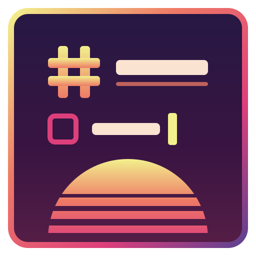

# omanote

A small markdown note editor for the terminal. Think *nano for markdown*: open it and type. There are no modes and nothing to configure, and it is a single binary.

Markdown renders as you write. Headings, **bold**, links, checkboxes, tables and images show formatted, and the raw syntax only appears on the line you are editing.

## Install

```sh
curl -fsSL https://raw.githubusercontent.com/iluxav/omanote/main/install.sh | sh
```

This downloads the latest release for your machine (Linux or macOS, x86_64 or ARM), verifies its checksum and puts `omanote` in `~/.local/bin`.

| Option | |
| --- | --- |
| `OMANOTE_VERSION=v0.1.0` | install a specific release |
| `OMANOTE_INSTALL_DIR=/usr/local/bin` | install somewhere else |

Uninstall (your notes are kept):

```sh
curl -fsSL https://raw.githubusercontent.com/iluxav/omanote/main/install.sh | sh -s -- --uninstall
```

### From source

Needs a [Rust toolchain](https://rustup.rs).

```sh
git clone https://github.com/iluxav/omanote && cd omanote
make install      # builds and copies to ~/.local/bin
make uninstall
```

## Use

```sh
omanote                 # a new, empty note
omanote notes/idea.md   # open a note, or start it if it does not exist
omanote --demo          # a note that shows everything off
```

Write first, name it later: on a new note `Ctrl+S` asks which vault to keep it in, with the file name prefilled from your first line (`# Trip plan` → `trip-plan.md`). From then on notes save themselves as you type.

| Key | |
| --- | --- |
| `Ctrl+P` | find a note by fuzzy search, or create one |
| `Ctrl+S` / `Ctrl+Q` | save / quit |
| `Ctrl+Z` / `Ctrl+Y` | undo / redo |
| `Ctrl+C` / `Ctrl+X` / `Ctrl+V` | copy / cut / paste |
| `Shift+arrows`, `Ctrl+A` | select |
| `Ctrl+arrows` | move by word |
| `Ctrl+B` / `Ctrl+I` | bold / italic |
| `Ctrl+T` | toggle a task checkbox |
| `Enter` | continues lists, numbering and quotes |

The mouse works too: click, drag to select, double-click a word, scroll, click a checkbox.

### Tables

Type a header row such as `| Item | Price |` and press `Enter`; the rest of the table is created for you.

| Key | |
| --- | --- |
| `Tab` / `Shift+Tab` | next / previous cell |
| `Enter` | down one row (adds a row at the bottom) |
| `Shift+Enter` | insert a row below |
| `Alt+Shift+→` / `Alt+Shift+←` | insert a column |

### Images

A line that is only an image shows the picture underneath it:

```markdown


```

Paste a screenshot with `Ctrl+V` and it is embedded in the note itself, so the file stays self-contained.

Real images need a terminal with the Kitty graphics protocol (Ghostty, Kitty). Other terminals get a low-resolution preview made of coloured blocks. Remote images are downloaded in the background and cached; set `OMANOTE_REMOTE_IMAGES=off` to never fetch them.

## Vaults

A vault is a folder of notes that `Ctrl+P` searches. New notes go in the default vault, `~/.omanote/docs`. Add more:

```sh
omanote --vl ~/work/notes          # a folder
omanote --vlgh owner/repo          # clone a GitHub repo and add it
omanote --vls                      # list vaults
omanote --vlrm notes               # forget a vault (files are kept)
```

Vaults are recorded in `~/.omanote/origins.toml`. GitHub vaults are cloned into `~/.omanote/vaults`; running `--vlgh` again pulls the latest.

## Development

```sh
make test       # run the tests
make release    # tag the version in Cargo.toml and push the tag
```

Pushing a `v*` tag makes GitHub Actions build the binaries and publish the release that `install.sh` downloads.
